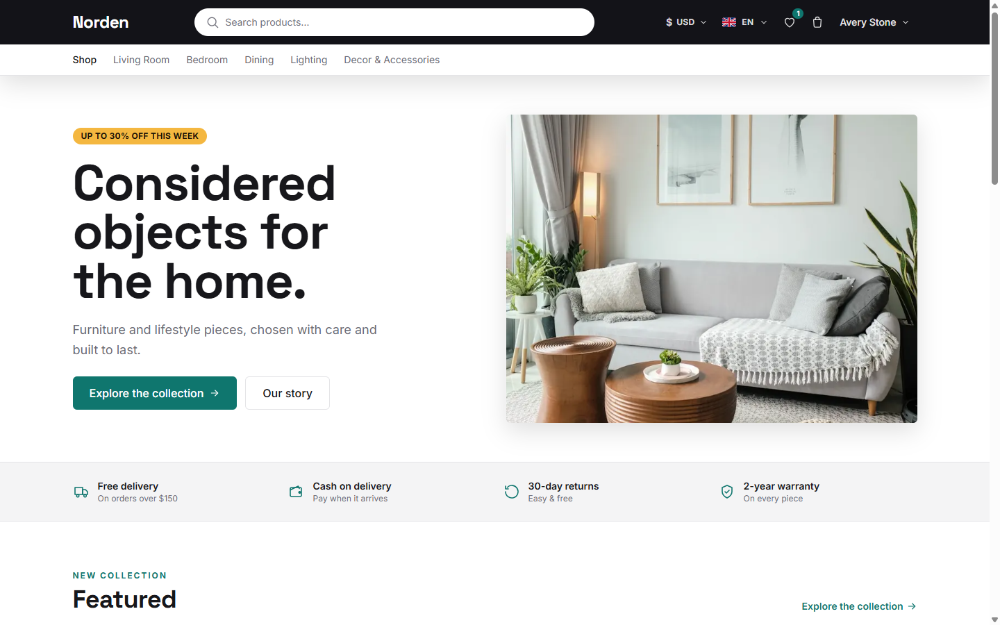
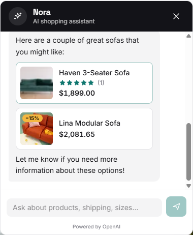
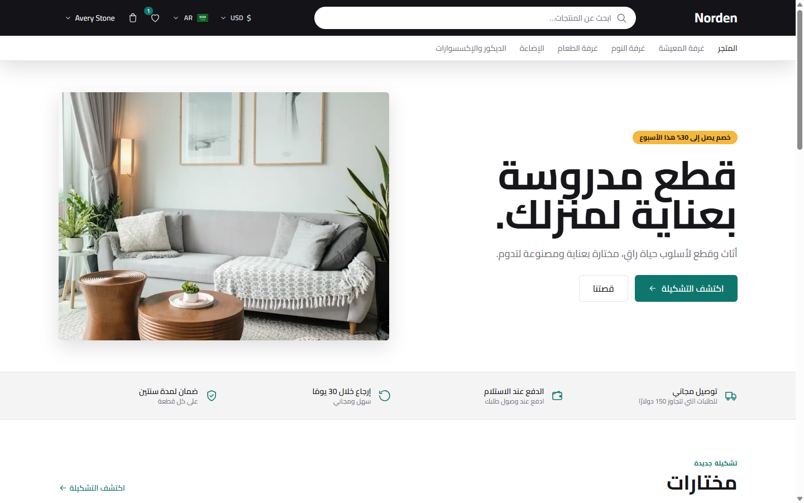
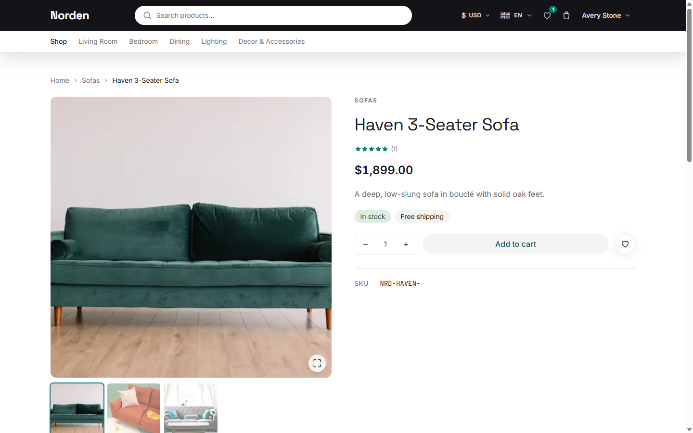
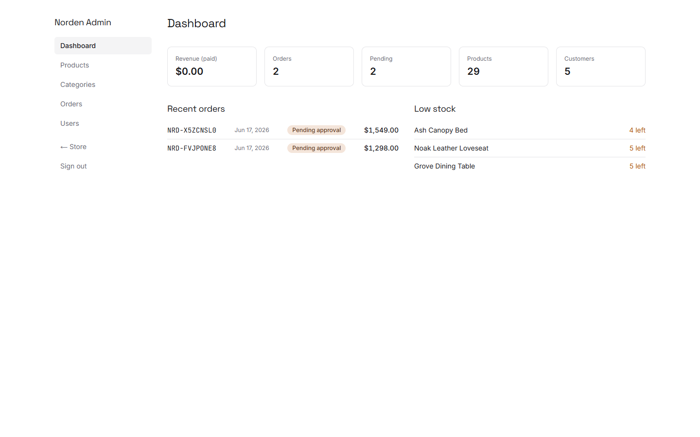

# 🛋️ Norden

**A modern, full-stack e-commerce store — storefront *and* admin panel you can actually shop.**
Three languages (English · Français · **العربية** with full right-to-left), live currency switching, cart,
checkout with Stripe — built as a portfolio piece to show how I write production code.

<p align="center">
  
</p>

<p align="center">
  <strong>🔗 Live demo &nbsp;·&nbsp; <a href="https://ecommerce.taha-seddik.online">ecommerce.taha-seddik.online</a></strong>
</p>

> A ground-up rebuild of an older Express / MySQL shop, redone with today's stack (Next.js 16, React 19,
> TypeScript). "Norden" is a placeholder brand (home & furniture) — no real customers.

---

## 🤖 Ask Nora — the AI shopping assistant

The headline feature: shoppers ask in plain language — *"a comfy sofa under $1,500"*, *"what do you sell?"* — and
**Nora searches the real catalogue and answers with live product cards** (photo, price, link) right in the chat.

- 🧠 **Agentic, not canned** — OpenAI **function-calling** over the live catalogue, so answers are always real and in-stock; she never invents a product or price.
- 🛍️ **Cards in the conversation** — matched products render inline as clickable cards.
- 🌍 **Trilingual & safe** — replies in EN / FR / AR, and it's rate-limited to run in public.

<p align="center">
  
</p>

---

## ▶️ Try it in 30 seconds

```bash
npm install
cp .env.example .env
npm run db:migrate && npm run db:seed
npm run dev                 # → http://localhost:4000
```

Then sign in with the **one-click demo buttons** on the login page — or:

- 👤 **Customer** — `customer@norden.example` · `password123`
- 🔑 **Admin** — `admin@norden.example` · `password123`

*…or just browse the **[live demo](https://ecommerce.taha-seddik.online)**.*

---

## 🛍️ What's inside

**Storefront**

- Home, category & product pages — server-rendered and SEO-ready
- Instant search popup + filters (category, price range, in-stock)
- Cart & wishlist that survive a refresh and merge into your account on login
- Checkout with **Cash on Delivery** or **Stripe** card payment
- Product reviews & star ratings
- **AI shopping assistant** — ask *Nora* in plain language; she searches the live catalogue and drops product cards into the chat

**Admin panel** (`/admin`)

- Dashboard — revenue, orders, low-stock at a glance
- Products, categories, orders & customers — full CRUD with image upload

**Everywhere**

- 🌍 Three languages — and Arabic flips the **entire layout** right-to-left
- 💱 Switch currency (USD / EUR / TND) on the fly

<p align="center">
  
  &nbsp;&nbsp;
  
</p>

---

## 🛠️ Built with

| | |
| --- | --- |
| **Framework** | Next.js 16 — App Router, Server Components, Server Actions · React 19 |
| **Language** | TypeScript (strict) |
| **Styling** | Tailwind CSS v4 · HeroUI v3 |
| **Database** | SQLite via Drizzle ORM — *just a file, no database server to run* |
| **Auth** | Custom JWT (`jose`) + `bcrypt`, role-based |
| **Payments** | Stripe Checkout + Cash on Delivery |
| **AI assistant** | OpenAI function-calling — *Nora* searches the real catalogue and embeds product cards |
| **i18n** | next-intl (EN / FR / AR + RTL) |

---

## 💡 A few things I'm proud of

- 🤖 **An AI assistant that actually shops** — agentic OpenAI function-calling queries the live catalogue and renders real product cards inline; never invents a SKU or price.
- 💳 **Payments you can trust** — the Stripe webhook is the source of truth: signature-verified, idempotent, and it
  marks the order paid, decrements stock, and clears the cart in a single transaction.
- 💰 **No floating-point money** — prices are integer cents end-to-end; currency conversion happens at the edge.
- 🌐 **Real RTL** — Arabic isn't a `dir` hack; the layout mirrors via CSS logical properties.
- ⚡ **Deliberate rendering** — product pages are statically generated with hourly revalidation (ISR) + JSON-LD for SEO.
- 🔒 **Secure by default** — httpOnly JWT cookies, role checks in middleware *and* every server action, image uploads
  re-encoded through `sharp` (never trusting the client).
- ✅ **Type-safe throughout** — validated environment, fully typed DB queries, zero `any`.

<p align="center">
  
</p>

---

## 🧩 How it's built

```
Server Component / Server Action  →  feature service  →  repository (Drizzle)  →  SQLite
```

Reads happen in Server Components; every change goes through a Zod-validated Server Action. Code is organized by
**feature** (`products`, `cart`, `checkout`, `orders`, `auth`, …). Money is stored as integer cents; translatable
text lives as `{ en, fr, ar }` JSON and falls back to English; order line-items snapshot their title + price so
history never changes. Conventions in [`CLAUDE.md`](./CLAUDE.md), design system in [`design.md`](./design.md).

---

## 🚀 Deploy

Ships as a Next.js **standalone** build behind **PM2 + Nginx** — SQLite is a file, so there's no database server to
manage. One command on the server:

```bash
bash deploy/deploy.sh        # pull → build → migrate → reload
```

Full walkthrough (env, TLS, Stripe webhook, persistence) in **[`DEPLOY.md`](./DEPLOY.md)**.
For Vercel: point the database at **Turso** and set `STORAGE_DRIVER=s3` — no code changes.

---

## 🗺️ Roadmap

Next up: order-confirmation email, recently-viewed rail, toast notifications, Playwright e2e tests, and full-text
search ranking. Intentionally out of scope: product variants, coupons, PDF invoices.

---

<sub>Built by Taha. Product photography from Unsplash.</sub>
